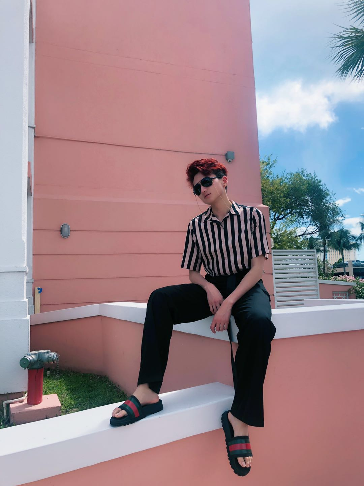

# THON部

## **王翌玮 Leo**

作为今年THON部的Primary Chair，在过去的一年里真的很开心和我的部员们一起尽我们所能为THON募捐，也让Penn state Thon看到了我们中国留学生的力量。作为Thon部一员的我真的很骄傲并且自豪。我也很荣幸以一名dancer的身份参加了2019年的Thon weekend，很感动能看到这么多同龄人为了分担小儿癌症家庭的苦痛和压力不断努力做慈善募捐活动给予他们精神以及资金上的支持。也感谢所有在过去一年里一直支持Thon部的所有人，是你们让thon部的所有成就成为可能。希望大家以后能一如既往的支持CSSA Benefiting Thon！

## **杨雅超 Stella**

很幸运可以加入CSSA，加入THON，在这里我遇到了很多有趣而优秀的人。祝即将毕业的大家前程似锦～

.png>)

## **白睿 Evelyn**

康德先生曾说，“有三样东西有助于缓解生命的辛劳：希望、睡眠和笑。” 对THON部而言，我们的努力若是能给一个个家庭带来希望，帮助孩子们重拾笑容，46小时不睡觉又怎样？作为新上任的Primary Chair，我希望能带领团队探索更新颖的筹款方式，策划出更具有影响力的活动，更有效的弘扬THON精神。CSSA Benefitting THON冲呀\~\~

.png>)

## **于洋 Vivian**

在CSSA THON部呆了快一年的时间啦，真的很荣幸可以大一就加入到CSSA的大家庭Thon部真的是非常chill的一个部门 大家都很有爱 彼此都互相帮助和配合 为了帮助癌症儿童我们都竭尽全力 希望在新的一年里 CSSA能够越来越好 为更多中华学子带来福利 Thon部能筹款到更多的钱。

.png>)

## **康玥童 Renee**

加入CSSA BENEFITTING THON整整一年了，认识了很多朋友也学到了很多新东西。感谢CSSA让我找到了更多的中国朋友也感谢CSSA BENEFITTING THON让我得以给更多的华人推广更赞的THON精神。希望新的一年能更好的为CSSA 服务，让更多的华人加入到CSSA的大家庭中。

.png>)

| 朱益广        | Thon Chair | 09/26/1996 | Envse                             |
| ---------- | ---------- | ---------- | --------------------------------- |
| 王翌玮        | Thon Chair | 07/27/1997 | 景观建筑和视觉艺术                         |
| 杨雅超        | 部员         | 06/02/1998 | Hospitality Mangement And Costume |
| 包若涵        | 部员         | 06/19/1996 | IE                                |
| 白睿         | 部员         | 9/11/1997  | Accounting                        |
| Renee Kang | 部员         | 10/26/1998 | DUS                               |
| 于洋         | 部员         | 2/21/2000  | DUS                               |
